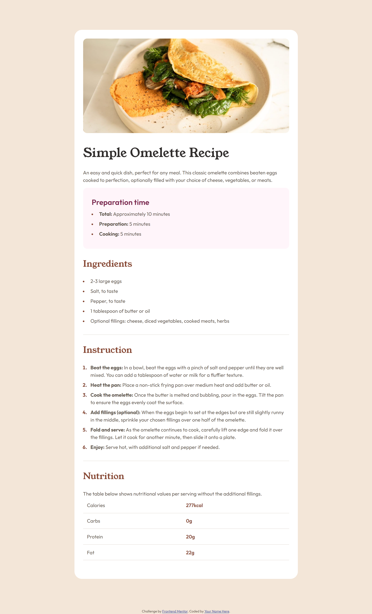

# recipe-page
# Frontend Mentor - Recipe page
## Table of contents

- [Overview](#overview)
  - [The challenge](#the-challenge)
  - [Screenshot](#screenshot)
  - [Links](#links)
- [My process](#my-process)
  - [Built with](#built-with)
  - [What I learned](#what-i-learned)
  - [Continued development](#continued-development)
- [Author](#author)

**Note: Delete this note and update the table of contents based on what sections you keep.**

## Overview

### Screenshot



### Links

- Solution URL: [https://github.com/meghaspatil1/recipe-page/](https://your-solution-url.com)
- Live Site URL: [https://meghaspatil1.github.io/recipe-page/](https://your-live-site-url.com)

## My process

### Built with

- Semantic HTML5 markup
- CSS custom properties
- Flexbox
- CSS Grid
- Mobile-first workflow
- Media set

### What I learned

How to divide the part with section, how to make coding more easy to check. 

To see how you can add code snippets, see below:

```html
<tr>
          <td data-cell="item">Calories</td>
          <td data-cell="values">277kcal</td>
        </tr>
```
```css
@media(max-width: 500px){
    .content{
        margin: 0;
        border-radius: 0;
        padding: 0;
    }}
```
### Continued development

main thing i uderstood how to divide the problem and the how to code.

## Author

- Website - [megha](https://github.com/meghaspatil1)
- Frontend Mentor - [@meghaspatil1](https://www.frontendmentor.io/profile/meghaspatil1)

